## Git 分支简介

在 Git 基础中，我们知道了 Git 保存的不是文件的变化或者差异，而是一系列不同时间的文件快照。

在进行提交操作时，Git 会保存一个提交对象，该对象会包含一个指向暂存内容快照的指针，且改提交对象还包含了作者的姓名、邮箱、提交信息以及指向它的父对象的指针。首次提交的提交对象没有父对象，普通提交的操作产生的提交对象有一个父对象，由多个分支合并产生的提交对象有多个父对象。

我们假设有一个工作目录，里面包含了三个将要被暂存&提交的文件。暂存操作会为每一个文件计算校验和（SHA-1），然后会把当前版本的文件快照保存到 Git 仓库中（Git 使用 blob 对象来保存它们），最终讲校验和加入到暂存区等待提交。

当使用 git commit 进行提交时，Git 会先计算每一个子目录的校验和，然后在 Git 仓库中这些校验和保存为树对象。随后，Git 便会创建一个提交对象，提交对象除了包含上面提到的那些信息外，还包含指向这个树对象的指针。

现在，Git 仓库中有五个对象：三个 blob 对象（保存文件快照）、一个树对象（记录着目录结构和 blob 对象索引）以及一个提交对象（包含着指向前述树对象的指针和所有的提交信息）

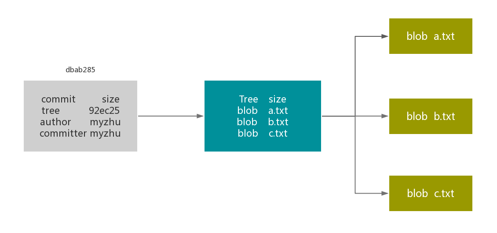

做一些修改后再次提交，那么这次产生的提交对象会包含一个指向上次提交对象的指针。

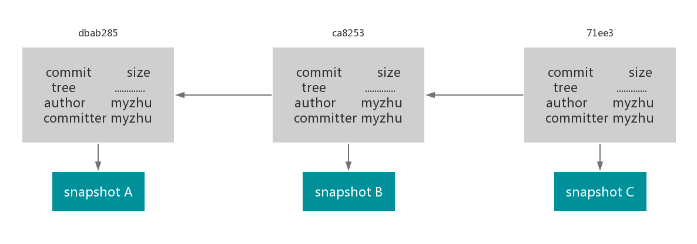

Git 的分支其实本质上仅仅是指向提交对象的可变指针。Git 默认分支名称是 master。在多次提交操作之后，你其实已经有一个指向最后哪个提交对象的 master 分支。它会在每次提交操作中自动向前移动。

master 分支并不是一个特殊分支。它跟其它分支完全没有任何区别。之所以每个仓库都会有一个 master 分支是因为 git init 命令默认创建了它，并且大多数人懒得修改它。

### 分支创建

```shell
# 创建一个新分支，但不会自动切换到新分支
$ git branch testing

# 创建一个新分支，并切换到这个新分支上
$ git checkout -b testing
```

只需要一个简单的命令，Git 就会为你创建一个可以移动的新指针。这会在当前所在的提交对象上创建一个新指针。
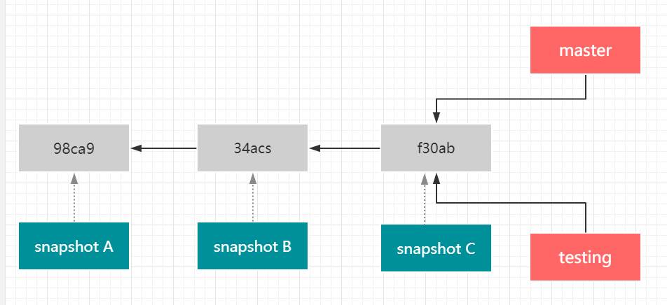

一个项目有多个分支，如何知道当前是在哪个分支上呢？Git 有一个名为 HEAD 的特殊分支。它指向了当前所在的本地分支。

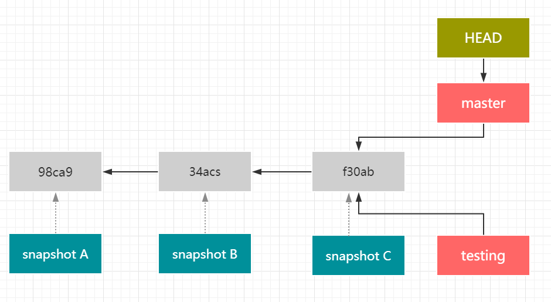

此时执行 git log --oneline --decorate 即可看到 master 和 testing 分支都是指向了 71ee34 ，HEAD 指向了 master。

```shell
$ git log --oneline --decorate
71ee334 (HEAD -> master, testing) add a,b,c
ca82532 (origin/master, origin/HEAD) test
dbab285 00
e35e70c Initial commit from Create React App

```

### 分支切换

```shell
$ git checkout testing
```

这样 HEAD 就指向了 testing 分支。

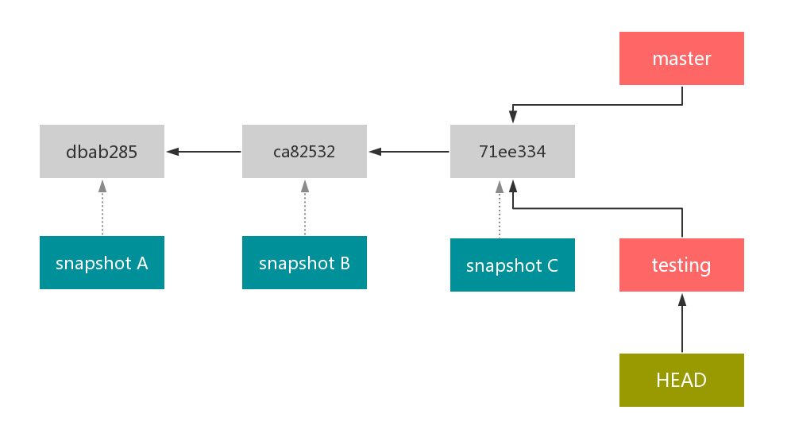

切换分支后，我们再提交一次。

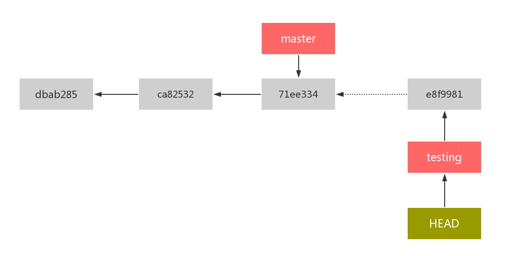

如图所示，testing 分支向前移动了，但是 master 分支并没有，它仍然指向了 git checkout 时所指的对象。我们再切回 master 分支：

```shell
$ git checkout master
```

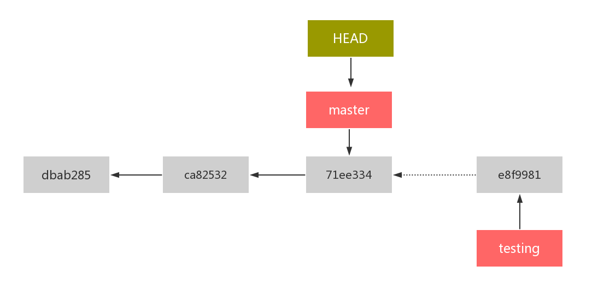

这条命令做了两件事。

1. 将 HEAD 指回 master
2. 将工作目录恢复成 master 分支所指向的快照内容

也就是说，你现在修改文件的话，项目将始于一个较旧的版本。本质上来讲就是忽略 testing 分支所做的修改，以便向零一个方向进行开发。

> 在切换分支的时候，一定要注意你工作目录里的文件会被改变。如果是切换到一个较旧的分支，你的工作目录会恢复到该分支最后一次提交时的样子。如果 Git 不能够干净地切换到旧分支，它就会禁止切换分支。在切换分之前一定要将当前分支的代码全部提交，不然会出现切换分支失败，且文件还可能会出现冲突。

在切回 master 分支后，做一些修改，然后提交。现在这个项目的提交历史就产生了分叉。

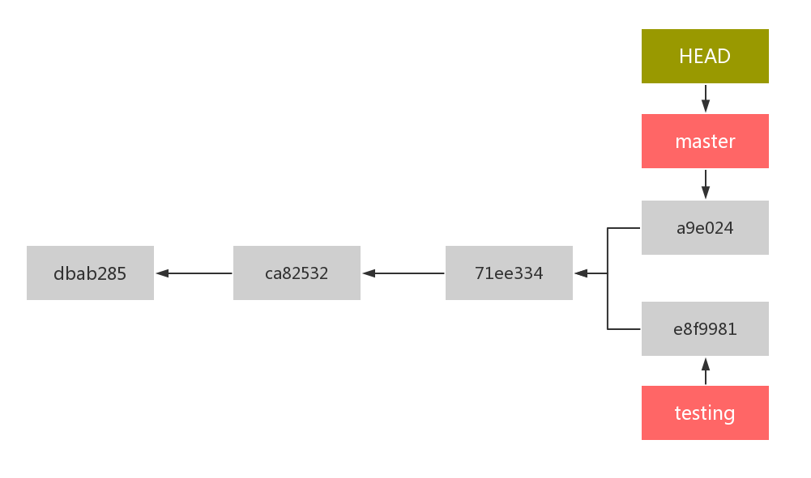

git log --oneline --decorate --graph --all

### 分支合并

假如在 testing 分支上有一个 bug 需要修复，执行 git checkout testing 切换分支，在 testing 分支上进行 bug 修复，然后提交。
现在需要将 testing 分支上的内容合并到 master 分支上来，执行：

```shell
# 切回 master 分支
$ git checkout master

Switched to branch 'master'

# 将 testing 分支上的内容合并到 master分支
$ git merge testing

Merge made by the 'recursive' strategy.
a.txt | 1 +
1 file changed, 1 insertion(+)

Auto-merging a.txt
CONFLICT (content): Merge conflict in a.txt
Automatic merge failed; fix conflicts and then commit the result.

```

将 testing 合并到 master 时，Git 需要做一些处理。Git 会使用两个分支的末端所指的快照 master 的 a9e024 和 testing 的 b7a7693 以及这两个分支的共同祖先 71ee334 ，做一个简单的三方合并。

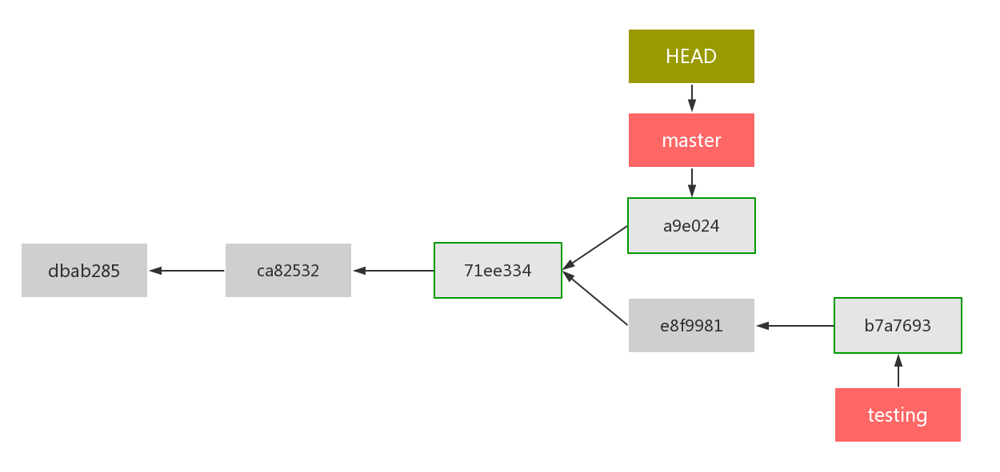

然后，Git 将此次三方合并的结果做了一个新的快照并且自动创建一个新的提交指向他。这个新的提交特别之处在于它不止有一个父提交。

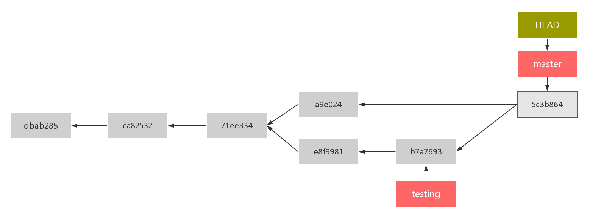

需要说的是，Git 会自动决定选取哪一个提交作为最优的共同祖先，并以此作为合并的基础。

#### 分支合并冲突

有时候分支合并并不顺利。假如在两个分支中，对同一个文件的同一个部分进行了不同的修改，Git 就不能干净的合并它们。在合并时就会产生冲突。

```shell

# 将 testing 分支上的内容合并到 master分支
$ git merge testing

Auto-merging a.txt
CONFLICT (content): Merge conflict in a.txt
Automatic merge failed; fix conflicts and then commit the result.

```

此时 Git 做了合并，但是没有自动的创建一个新的合并提交。Git 会停下来，等待冲突解决。我们可以合并冲突后的任意时刻使用 git status 来查看那些因为包含合并冲突而处于未合并（unmerged）状态的文件:

```shell
$ git status

On branch master
You have unmerged paths.
 (fix conflicts and run "git commit")
Unmerged paths:
 (use "git add <file>..." to mark resolution)
 both modified: a.txt
no changes added to commit (use "git add" and/or "git commit -a")

```

任何因包含合并冲突而待解决的文件，都会以未合并状态标识出来。Git 会在有冲突的文件中加入标准的冲突解决标记，这样就可以打开这些包含冲突文件，然后手动解决冲突。出现冲突的文件会包含一些特殊的区段：

```
<<<<<<< HEAD:a.txt
master 分支的内容
=======
testing 分支的内容
>>>>>>> testing:a.txt
```

======= 上半部分是 master 分支的内容，======= 下半部分是 testing 的内容，我们必须选择这两部分其中的一个，或者自行合并这些内容，将这些冲突内容换成下面的样子即可

```
master & testing 的内容
```

在解决所有的冲突后，对每个文件使用 git add 命令，来将其标记为冲突已解决。一旦暂存了这些原本有冲突的文件，Git 就会将其标记为冲突已解决。当我们确定冲突完全解决后，就可以提交了。

#### 快进式分支合并

假如我们在 master 分支上出现了一个紧急 bug 207。我们在 master 分支上切出一个分支 bug207

```shell
$ git checkout -b bug207
```

进行了一些修改，测试后通过，然后提交。切换到 master 分支上，需要把 bug207 分支上的内容合并到 master 上

```shell
$ git add a.txt

$ git commit -m "bug207的修改"

$ git push origin bug207

$ git checkout master

$ git merge bug207
Updating 5c3b864..98bf158
Fast-forward
 a.txt | 4 +++-
 1 file changed, 3 insertions(+), 1 deletion(-)

```

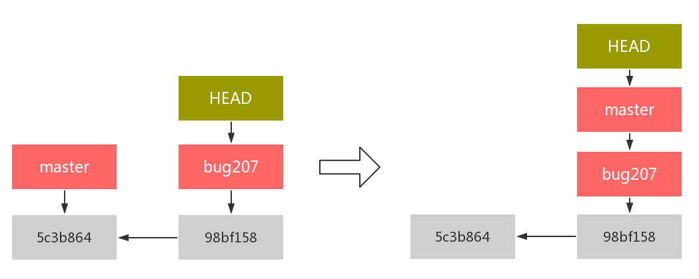

由于当前 master 分支所指向的提交是当前提交的直接上游，所以 Git 只是简单的将指针向前移动。换句话说，当你试图合并两个分支时，如果顺着一个分支能够直接到达另一个分支时，那么在合并时，Git 只是简单的将指针向前推进。这种合并操作没有需要解决的分歧就叫做 “ 快进（fast-forward）”

### 分支的删除

当一个分支不在需要了，可以执行：

```shell
$ git branch -d <branch-name>
```

被删除的分支必须是已合并的，且不是当前分支。

一些跟分支相关的命令：

| 命令                   | 作用                                                         |
| ---------------------- | ------------------------------------------------------------ |
| git branch             | 列出所有分支 \* 标注的分支是当前分支，也就是 HEAD 指向的分支 |
| git branch -v          | 查看每个分支的最后一次提交                                   |
| git branch --merged    | 查看哪些分支已经合并到当前分支                               |
| git branch --no-merged | 查看哪些分支没有合并到当前分支                               |

### 分支开发工作流

#### 长期分支

#### 特性分支
