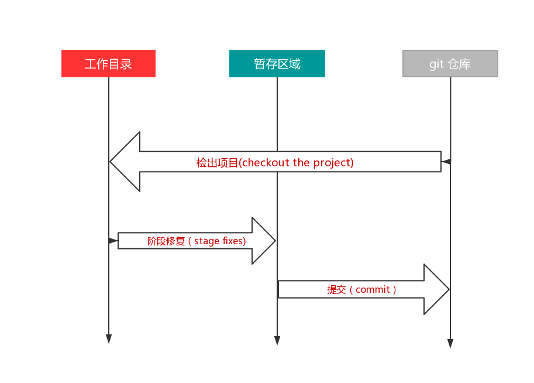

## Git

### Git 起源

Git 源自 Linux 内核开源项目。

Linux 内核开源项目组在 2002 年开始使用 BitKeeper 来管理和维护代码，到了 2005 年，开发 BitKeeper 的商业公司和 Linux 内核开源社区的合作关系结束，Linux 内核开源社区就不能免费使用 BitKeeper，这个就迫使项目组自己开发一个项目管理系统也就是 Git。项目组在开发 Git 时，吸取了 BitKeeper 的经验教训，做出的非常大的改进，对这个新系统制定了若干目标：

1. 速度
2. 简单的设计
3. 对非线性开发模式的强力支持（允许成千上万个并行开发分支）
4. 完全分布式
5. 有能力高效管理类似 Linux 内核一样的超大规模项目

### Git 与其他控制系统的区别和特点

#### 主要区别

Git 和其他的版本控制系统的主要区别在于 Git 对待数据的方法。

其他大部分的系统(例如：svn)以文件变更列表的方式存储信息，将保存的信息看作是一组基本文件和每个文件随时间逐步累积的差异。

Git 像是把数据看作是对小型文件系统的一组快照。每次提交更新，或在 Git 中保存项目状态时，它主要对当时的全部文件制作一个快照并保存这个快照的索引。为了高效，如果文件没有修改，Git 不再重新存储该文件，而是只保留一个链接指向之前的文件。Git 对待数据更像是一个快照流。

#### Git 的特点

1. 绝大多数的操作都是本地执行
   我们在克隆项目时，会将远程仓库中几乎所有的数据都克隆下来，而不是一个版本一个版本的克隆出来，这样就能在本地查询对比，只有在上传、克隆等少数操作时，才需要联网
2. 保证完整性
   Git 所有数据在存储前都计算校验和，然后以检验和来引用。校验和是基于 Git 中的文件的内容或目录结构计算出来的 40 个十六进制字符。所以不可能在 Git 不知情更改任何内容。
3. 一般只添加数据
   在执行 Git 操作时，几乎只能往 Git 数据库中增加数据，很难让 Git 执行任何不可逆操作。

### Git 文件状态

一：已跟踪(已纳入版本控制)

1. 已提交（数据已经提交到本地数据库中）
2. 已修改（文件修改了，但是还没有提交到数据库中）
3. 已暂存（已暂存表示对一个已修改文件的当前版本做了标记，使之包含在下次提交的快照中）

二:未跟踪（未纳入版本控制）

由此也引出了 Git 项目的三个工作区域的概念：Git 仓库、工作目录以及暂存区域。



Git 仓库目录是 Git 用来保存项目的源数据和对象数据库的地方。这是 Git 中最重要的部分，从其它计算机克隆仓库时，拷贝的就是这里的数据。

工作目录是对项目的某个版本独立拉取出来的内容。这些从 Git 仓库的压缩数据库中提取出来的文件，放在磁盘上供使用和修改。

暂存区域是一个文件，保存了下次将要提交的文件列表信息，一般在 Git 仓库目录中。有时候也称作“索引”。

基本的 Git 工作流程如下：

1. 在工作目录中修改文件
2. 暂存文件，将文件的快照放入暂存区域
3. 提交更新，找到暂存区域的文件，将快照永久性存储到 Git 仓库目录。

### 初次 Git 配置

首次运行 git 时需要设置用户信息（如果没有设置在提交时会提醒设置），

```shell

$ git config --global user.name "NAME"

$ git config --global user.email "EMAIL"

# 配置默认编辑器
$ git config --global core.editor xxx

# 查看配置列表

$ git config --list

```

--global 命令是针对全局的。如果你想针对特定项目使用不同的用户名和邮箱时，那就可以在项目的根目录下运行没有--global 的命令

### 忽略文件

有一些文件我们不需要纳入版本控制，也不希望它们出现在未跟踪文件列表中。比如： /node_modules 整个文件夹，以及 package-lock.json 这种自动生成的文件，还有一些打包时的错误日志文件。在这种情况下我们可以创建一个名为.gitignore 的文件，列出要忽略的文件模式。

```shell
*.[oa]
*~
```

第一行告诉 Git 忽略所有的以 .o 或 .a 为结尾的文件
第二行告诉 Git 忽略所有以~结尾的文件

.gitignore 格式规范：

- 所有的空行或者以#开头的行都会被 git 忽略
- 可以使用标准的 glob 模式[^foot1]匹配
- 匹配模式可以以（/）开头防止递归
- 匹配模式可以以（/）结尾指定目录
- 要忽略指定模式以外的文件或目录，可以在模式前加上感叹号（!）取反。

[^foot1]: 所谓的 glob 模式是指 shell 所使用的简化了的正则表达式。 星号（\*）匹配零个或多个任意字符；[abc] 匹配任何一个列在方括号中的字符（这个例子要么匹配一个 a，要么匹配一个 b，要么匹配一个 c）；问号（?）只匹配一个任意字符；如果在方括号中使用短划线分隔两个字符，表示所有在这两个字符范围内的都可以匹配（比如 [0-9] 表示匹配所有 0 到 9 的数字）。 使用两个星号（\*) 表示匹配任意中间目录，比如 a/\*\*/z 可以匹配 a/z , a/b/z 或 a/b/c/z 等。

再看一个例子：

```shell
# 排除 .a 文件
*.a

# 对lib.a 文件进行跟踪，即使上面已经排除了 .a 文件
!lib.a

# 只排除当前目录下的TODO文件，但是不排除其他文件夹下的TODO文件
/TODO

# 排除build文件夹下的所有文件
build/

# 只排除doc根目录下的 .txt文件，非根目录下的 .txt文件不排除
doc/*.txt

# 排除 doc 目录下 所有的 .pdf文件
doc/**/*.pdf
```

### Git 常用命令

```shell
# 克隆一个远程仓库

$ git clone URL

# 克隆一个远程仓库 并自定义本地仓库名

$ git clone URL NEW_NAME

# 检查当前文件状态

$ git status

# 紧凑展示当前文件状态
# 新添加未跟踪 ??
# 新添加到暂存区 A
#   M修改了，但是还未放入暂存区
# M  修改了并已放入暂存区
$ git status -s || --short

# 开始跟踪某个文件/暂存某个文件
# 如果xxx是一个路径，将递归跟踪该路径下所有文件
$ git add xxx

# 暂存所有文件
$ git add .

# 本地提交
$ git commit

# -m 是直接写提交信息， 如果
$ git commit -m "提交信息"

# 推送到远程服务器
$ git push
```

#### git diff 对比

使用 git status 命令我们能够知道各个文件的状态，但是不能够知道每个文件具体修改了哪些地方？这个时候就有了 git diff 这条命令。

git diff 命令只能查看尚未暂存的文件修改了哪些部分，它比较的是文件目录当前文件与暂存区域快照的差异。如果想要查看已暂存的将要添加到下次提交里的内容，可以用 git diff --cached 或者 git diff --staged

#### git commit 提交

提交命令，提交暂存区域的数据。在执行该命令之前一定要确定所有的文件都已经 git add 过了，不然提交时，是不会记录这些没有暂存的文件。这些没有暂存的文件只会保留在本地磁盘。执行该命令后，Git 会启动文本编辑器，一遍输入本次提交说明（如果没有配置编辑器就会默认打开 git 的 nano 编辑器）。

如果不想打开编辑器填写提交说明也可以执行 git commit -m "提交信息" 提交。

还有一种提交方法是 git commit -a -m "提交信息" 这种提交方式可以直接跳过暂存步骤，将所有已跟踪的文件暂存起来，然后一并提交。

我们提交的文件的时候，有可能忘了提交某些文件、或者提交信息写错了

```shell
$ git commit --amend
```

#### git rm 删除

如果我们想从项目中删除某个文件，就必须要从已跟踪的文件清单（暂存区）中移除，然后再提交，这样才能彻底从项目中删除该文件。此时我们就要使用 git rm 命令。

```shell
$ git rm yy.md
rm 'yy.md'
```

下一次提交的时候，该文件就不会被提交。如果，在删除之前文件已经放到了暂存区域的话，就需要使用强制删除 -f 。

还有一种情况是，忘记在 .gitignore 文件中添加忽略文件，不小心把某个日志文件或编译后的文件提交到暂存区时，就需要用到 --cached :

```shell
$ git rm --cached node_modules
```

#### git mv 重命名

```shell
# 将 a 改名为 b
$ git mv a b

# 等同于
$ mv a.js b.js
$ git rm a.js
$ git add b.js
```

### 查看历史

查看所有的历史纪录可以直接使用 git log ，不带任何参数时，会按照提交时间列出所有的更新，包括每一个提交的 SHA-1 校验和、作者、邮箱、时间、提交信息。

1. -p 用来显示每次提交的内容差异， 也可以加上 -2 来仅显示最近两次的提交

```shell
$ git log -p -2
```

2. --stat 查看提交的简略统计信息

```shell
$ git log --stat
```

3. --pretty 可以指定不同于默认的格式展示提交历史

```shell
$ git log --pretty=oneline
```

内建的子选项

| 子选项           | 功能                                    |
| ---------------- | --------------------------------------- |
| oneline          | 将每个提交放在一行显示                  |
| short            | 和默认 git log 相似，但不显示时间       |
| full             | 比默认输出少了时间，多了一个 Commit     |
| fuller           | 比 full 多了 AuthorDate 和 CommitDate   |
| --name-only      | 仅在提交信息后显示已修改文件清单        |
| --name-status    | 显示新增、修改、删除文件清单            |
| --abbrev-commit  | 仅显示 SHA-1 的前几个字符               |
| --relative-date  | 使用较短的相对时间显示 ，多久以前的方式 |
| --graph          | 使用 ASCII 图形表示分支合并历史         |
| --pretty         | 定制要显示的格式                        |
| -(n)             | 仅显示最近 n 条提交                     |
| --since,--after  | 仅显示指定时间之后的提交                |
| --until,--before | 仅显示指定时间之前的提交                |
| --author         | 仅显示指定作者提交的提交                |
| --committer      | 仅显示指定提交者相关的提交              |
| --no-merges      | 仅显示未合并的提交                      |
| --grep           | 仅显示指定关键字的提交                  |
| -S               | 仅显示添加或移除了某个关键字的提交      |

一个完整的例子：
查找 2019 年 8 月份 blithe6317 提交的关于 函数 test 的提交内容

```shell
$ git log --since="2019-8-01" --before="2019-9-01" -S"function test"
```

#### fomat

```shell
$ git log --pretty=format:"%h - %an, %ar : %s "
```

format 常用选项说明

| 选项 | 说明                         |
| ---- | ---------------------------- |
| %H   | 提交对象的完整哈希字串       |
| %h   | 提交对象的简短哈希字串       |
| %T   | 树对象的完整哈希字串         |
| %t   | 树对象的简短哈希字串         |
| %P   | 父对象的完整哈希字串         |
| %p   | 父对象的简短哈希字串         |
| %an  | 作者名字                     |
| %ae  | 作者邮箱                     |
| %ad  | 作者修改日期                 |
| %ar  | 作者修改日期，按多久以前显示 |
| %cn  | 提交者                       |
| %ce  | 提交者邮箱                   |
| %cd  | 提交日期                     |
| %cr  | 提交日期，按多久以前显示     |
| %s   | 提交说明                     |

作者和提交者的区别是：作者是实际作处修改的人，提交者是最后将此工作成果提交到仓库的人

### 撤销操作

在任何一个阶段我们都有可能想要做某些撤销操作，这里介绍几个常见的撤销操作。

#### 重新提交
