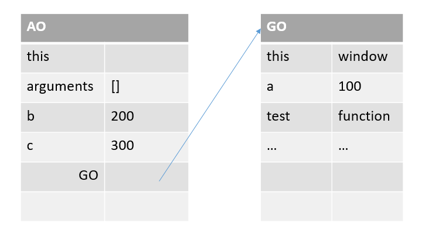

## js 作用域 (变量作用域)

变量作用域又叫变量的可见性
在 JavaScript 中作用域一共分为两种：

1. 全局作用域
2. 块级作用域 （局部作用域）

### 全局作用域

全局作用域比较简单，如果一个变量的作用域是全局的，那么这个变量可以在全局的任何一个地方使用。
在全局作用域中起作用的变量就叫做全局变量。

```javascript
var a = 0;

function test() {
  return a++;
}

test();
console.log(a);
```

```javascript
function test() {
  var a = 123;
  b = 123;
}
test();
console.log("a:", a);
console.log("b:", b);
```

###　块级作用域

一个变量在块级区域内起作用，那么这个变量的作用域就是块级作用域。

```javascript
function test() {
  var a = 0;
  return a + 1;
}

test();
console.log(a);
```

全局变量实现了一处声明，到处使用。

虽然全局变量使用起来比较方便，但是尽量不使用全局变量。（为什么？）

```javascript
var a = 1;

function test() {
  var a = 5;
  console.log(a);
}
console.log(a);
test();
```

### 作用域链

在 JavaScript 中，一切皆对象。函数也和其他对象一样，拥有可以通过代码访问的属性和一系列仅供 JavaScript 引擎访问的内部属性。其中的一个内部属性就是[[Scope]]，该内部属性包含了函数被创建的作用域中的对象集合，这个集合也就被称为作用域链。

我们在执行一个函数时，会创建一个称为“执行期上下文”的内部对象，执行期上下文定义了函数执行时的环境。每一个执行期上下文都有自己的作用域链，用于标识符解析，当执行期上下文被创建的时候，它的作用域初始化为当前运行函数的[[Scope]]所包含的对象。

这些值按照它们出现在函数的顺序被复制到执行期上下文的作用域链中。它们共同组成了一个新的对象，叫做“活动对象（activation object）”，该对象包含了函数的所有局部变量、命名参数、参数集合以及 this，然后此对象会被推入作用域的前端，当执行期上下文被销毁，活动对象也随之销毁。

我们可以将全局作用域的活动对象称为 GO，局部作用域的活动对象称为 AO。

```javascript
var a = 100;
function test() {
  var b = 200;
  var c = 300;
  console.log(a);
  console.log(b);
  console.log(c);
}
```

将上面代码的作用域以图表的形式展示出来：



## 变量提升

我们可以通过几行代码来看一下变量提升表现出来的情形：

```javascript
// 1.
console.log(test);
var test = 100;

// 2.
console.log(test);
function test() {}
```

那么为什么会出现这种情况呢？
我们首先得了解 js 是怎么运行的？

1. 语法解析
   通篇扫描代码，查看代码是否存在语法上的错误，语法解析并不执行代码

2. 预编译

3. 解释执行
   解释一行，执行一行

预编译的过程，就是出现这种情况的原因。

## 预编译过程

预编译发生在函数执行的前一刻。

我们在使用函数或者变量之前都会去声明这个函数或变量，声明后我们才能够使用。

1. 未经声明就赋值的变量就是全局变量
2. 一切声明的全局变量全是 window 的属性

```javascript
// 变量声明
var a = 100;
// 函数声明
function test() {
  // 使用变量
  console.log(a);
}
// 使用函数
test();
```

在预编译过程中，会将所有的声明提到函数体的最前面，也就是声明提升。声明提升有两条规则：

1. 函数声明 整体提升
2. 变量声明 声明提升

```javascript
// 例子：
var a = 100;
function test() {
  a = 200;
  var b = 10;
  function fn() {}
  b = 300;
}
test();

// 变量提升后：
var a = 100;
function test() {
  // 预编译
  var b;
  function fn() {}
  // 预编译结束

  // 函数执行
  a = 200;
  b = 10;
  b = 300;
  // 函数执行完成
}
test();
```

这就是声明提升的最基础的体现。

小测试：

```javascript
// 例子 1：
var a = 100;
function test() {
  console.log("a:", a);
  console.log("b:", b);
  a = 200;

  var b = 10;
  console.log("b:", b);
  function fn() {}
  b = 300;
  c = 200;
}
test();
console.log("c:", c);

// 例子 2：
var a = 100;
function test() {
  console.log("a:", a);
  console.log("b:", b);
  var a = 200;

  console.log("a:", a);
  var b = 10;
  console.log("b:", b);
  function b() {}
  b = 300;
  c = 200;
}
test();
console.log("c:", c);
```

声明提升的过程中，有以下 4 个步骤：

1. 创建 执行期上下文 AO (Activation Object)对象
2. 找形参和变量声明，将变量和形参名作为 AO 属性名，值为 undefined
3. 将实参值和形参值统一
4. 在函数体里面找函数声明，值赋予函数体

```javascript
// 测试 1：
function fn(a) {
  console.log("a 0：", a);

  var a = 123;
  console.log("a 1：", a);

  function a() {}
  console.log("a 2：", a);

  var b = function() {};
  console.log("b 0：", a);

  function d() {}
  console.log("d 0：", a);
}

fn(1);

// 测试 2：
function test(a, b) {
  console.log(a);
  c = 0;
  var c;
  a = 3;
  b = 2;
  console.log(b);
  function b() {}
  function d() {}
  console.log(b);
}
test(1);

// 测试 3：
function test(a, b) {
  console.log(a);
  console.log(b);
  var b = 234;
  a = 123;
  function a() {}
  var a;
  console.log(a);
  b = 234;
  console.log(b);
  var b = function() {};
  console.log(b);
}
test(1);

// 测试 4：
function bar() {
  return foo;
  foo = 10;
  function foo() {}
  var foo = 11;
}

// 测试 5：
function bar() {
  foo = 10;
  function foo() {}
  var foo = 11;
  return foo;
}

// 测试 6：
a = 100;
function demo(e) {
  function e() {}
  arguments[0] = 2;
  console.log(e);
  if (a) {
    var b = 123;
    function c() {}
  }
  var c;
  a = 10;
  var a;
  console.log(b);
  f = 123;
  console.log(c);
  console.log(a);
}
var a;
demo(1);
console.log(a);
console.log(f);
```
